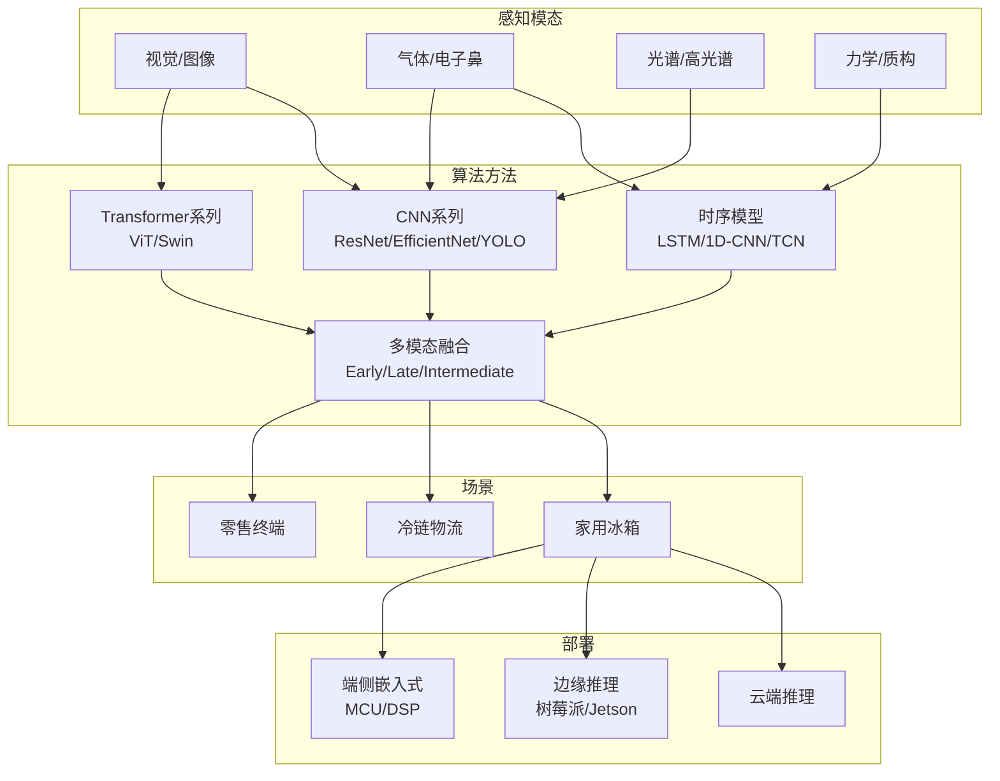

# 综述论文完整框架

## 论文标题

**面向智能冰箱场景的食材新鲜度智能检测技术：方法综述与展望**

*(Intelligent Food Freshness Detection for Smart Refrigerator Scenarios: A Comprehensive Review and Outlook)*

---

## 一、为什么选综述论文？——可行性分析

| 条件 | 你的情况 | 综述论文的要求 |
|------|----------|---------------|
| 实验平台 | 无冰箱、无传感器 | **不需要** - 只需文献调研 |
| 计算资源 | 电脑跑不了模型 | **不需要** - 只需阅读理解 |
| 数据集 | 无自建数据 | **不需要** - 引述已有工作即可 |
| 编程能力 | 可能有限 | **不需要** - 只需分析与归纳 |
| **核心工作** | | **读论文 → 分类归纳 → 对比分析 → 提出趋势** |

**综述论文的本质：你是"学术导游"**，帮读者系统梳理这个领域：谁做了什么、用什么方法、效果如何、还有什么问题没解决。

---

## 二、为什么这个选题可以做综述？

### 现有综述的局限性（你的切入空间）

| 已有综述 | 覆盖范围 | 你的优势 |
|----------|----------|----------|
| "电子鼻在肉类品质中的应用" (Food Analytical Methods, 2018) | 仅电子鼻+肉类 | 你覆盖视觉+电子鼻+多模态 |
| "食品工业中电子鼻应用进展" (多篇中文综述) | 仅气体传感 | 你将深度学习方法纳入主线 |
| "深度学习在食品安全中的应用" (丁浩晗等, 食品科学, 2025) | 食品安全全链条，新鲜度只是其一 | 你聚焦"新鲜度检测+冰箱场景" |
| "多模态融合综述" (CMC, 2024) | 通用方法，无食品领域聚焦 | 你聚焦冰箱+食材场景的领域适配 |
| "AI in Food Manufacturing" (arXiv, 2025) | 全产业链，范围过宽 | 你聚焦一个垂直子问题 |

**>>> 核心结论：目前没有一篇综述专门从"深度学习+多传感器融合"的视角系统梳理冰箱场景下的食材新鲜度检测技术。这是一个明确的研究空白。**

---

## 三、综述论文的核心框架（四维分类法）

传统综述往往按"技术路线"分类（视觉 vs 电子鼻 vs 光谱），太粗了。你采用**四维交叉分类法**，这就是创新。

```
维度一：感知模态（Perception Modality）
    视觉 ─ 气体 ─ 触觉/力学 ─ 光谱 ─ 多模态融合

维度二：算法方法（Algorithmic Approach）
    传统ML ─ CNN系 ─ Transformer系 ─ 时序模型 ─ 大模型

维度三：应用场景（Application Scenario）
    冰箱冷藏 ─ 冷链物流 ─ 零售终端 ─ 实验室通用

维度四：部署层级（Deployment Level）
    云端 ─ 边缘端 ─ 端侧嵌入式
```

### 这张四维交叉分类框架图就是你的核心创新：



---

## 四、论文详细大纲

```
摘要
  概述食材新鲜度检测的研究背景与应用需求
  介绍本文的系统综述方法（检索策略、纳入/排除标准、论文筛选流程）
  总结主要发现和分类框架
  指出当前挑战和未来趋势

第一章  引言
  1.1 研究背景
      - 全球食物浪费现状（数据引用：FAO报告，中国损耗率20%+）
      - 智能冰箱市场趋势（2025年全球智能冰箱市场规模，智能化升级路径）
      - 消费者痛点：无法实时掌握食材新鲜度
  1.2 问题定义与研究范围
      - 界定"食材新鲜度智能检测"的内涵
      - 明确综述范围：家用冰箱场景 + 冷链物流 + 零售终端
      - 排除范围：加工食品货架期预测（本质不同的问题）
  1.3 与其他综述的区别（这是关键！）
      - 表格对比已有综述的覆盖范围
      - 明确本文的独特贡献：四维交叉分类框架
  1.4 文献检索方法
      - 数据库：Web of Science / Scopus / IEEE Xplore / CNKI
      - 关键词组合：(food freshness OR food spoilage) AND (deep learning OR CNN OR Transformer OR YOLO OR electronic nose OR multi-sensor OR computer vision)
      - 时间范围：2015-2026
      - 筛选流程：初检→去重→标题摘要筛选→全文筛选→最终纳入N篇
      - PRISMA流程图（必须画）
  1.5 本文组织架构

第二章  食材新鲜度检测的技术基础
  2.1 食材腐败的理化机制
      - 肉类腐败：蛋白质分解→TVB-N↑、微生物增殖→菌落总数↑、脂肪氧化→酸价↑
      - 果蔬腐败：呼吸作用→糖分消耗、乙烯释放↑、细胞壁降解→软化、微生物侵染→腐烂
      - 腐败过程中释放的VOCs特征谱（氨气、硫化氢、三甲胺、乙醇、醛酮类…）
  2.2 常见新鲜度检测的"金标准"
      - 感官评价（GB/T 22210）
      - TVB-N测定（半微量定氮法）
      - K值（ATP降解产物比值，适合水产品）
      - 菌落总数（平板计数法）
      - pH值变化
  2.3 各传感模态的工作原理
      - RGB/多光谱相机
      - MOS/MEMS气体传感器
      - 高光谱成像
      - 近红外光谱
      - 电子舌/味觉传感器
      - 触觉/硬度传感器

第三章  基于计算机视觉的食材新鲜度检测方法
  3.1 传统图像处理方法
      - 颜色空间分析（RGB/HSV/L*a*b*颜色特征统计）
      - 纹理分析（GLCM/LBP/Gabor滤波器）
      - 形态学特征（面积收缩率、边缘规则性）
      - + SVM/随机森林/Random Forest分类器
      - 局限性：人工设计特征，泛化能力弱
  3.2 基于CNN的深度学习方法
      - 分类网络：ResNet/VGG/EfficientNet/MobileNet 应用于新鲜度分级
      - 目标检测：YOLOv5→v8→v10→v11→v12 在冰箱食材识别中的演进
      - 语义分割：UNet/DeepLab 用于腐败区域精确定位
      - 典型工作的汇总对比表
  3.3 基于Transformer/Attention的方法
      - ViT/Swin Transformer 在食材细粒度分类中的应用
      - 自注意力机制对遮挡食材的特征补偿
      - 与CNN方法的优缺点对比
  3.4 视觉方法的优势与局限
      | 优势 | 局限 |
      |------|------|
      | 非接触、无损 | 仅检测表面信息 |
      | 硬件成本低（摄像头普及） | 无法感知气味/内部腐败 |
      | 识别+定位+分类一步到位 | 光照/遮挡/视角影响大 |
      | 数据标注相对直观 | 早期腐败外观变化不明显 |

第四章  基于气体传感的食材新鲜度检测方法
  4.1 电子鼻系统的组成与工作原理
      - 传感器阵列 → 信号调理 → 特征提取 → 模式识别
      - 常见MOS传感器型号与敏感气体对照表
  4.2 传统模式识别方法
      - PCA（主成分分析）+ LDA（线性判别分析）
      - SVM/KNN/ANN 分类器
      - 局限性：依赖手工特征，交叉敏感难处理
  4.3 基于深度学习的电子鼻信号处理
      - 1D-CNN 用于传感器信号的特征提取
      - LSTM/GRU 用于气体响应时序建模
      - 深度学习对传感器交叉敏感的"解耦"能力
      - CNN-LSTM 混合模型用于多步新鲜度预测
      - 代表性工作总结表
  4.4 冰箱场景的特殊挑战
      - 背景气味干扰（食材混合、塑料挥发物）
      - 传感器漂移与老化（长期稳定性）
      - 低温环境对传感器灵敏度的影响
      - 小型化/低功耗要求
  4.5 气体传感方法的优势与局限
      | 优势 | 局限 |
      |------|------|
      | 可检测内部化学变化 | 无法定位/分类食材 |
      | 早期腐败气味先于外观变化 | 传感器交叉敏感 |
      | 检测不受光照/遮挡影响 | 传感器老化漂移 |

第五章  多模态融合的新鲜度检测方法
  （本章是你的论文中最有价值的部分）

  5.1 多模态融合的必要性
      - 视觉：知道"什么食材、在哪里、外观如何"
      - 气体：知道"什么气味、腐败程度"
      - 温湿度：知道"存储环境上下文"
      - 三者互补 → 完整的食材状态画像
      - 引用表格：各模态的能力矩阵（雷达图概念的表格版）

  5.2 融合层次分类体系
      5.2.1 数据层融合（Early Fusion）
          - 原始信号拼接 → 统一处理
          - 典型案例：高光谱图像（空间+光谱天然融合）
          - 优缺点：信息完整但计算开销大、时域对齐困难
      5.2.2 特征层融合（Intermediate Fusion）
          - 各模态独立编码 → 特征向量拼接/注意力融合
          - 典型案例：视觉CNN + 电子鼻1D-CNN → 联合特征
          - 是本综述推荐的主流技术路线
      5.2.3 决策层融合（Late Fusion）
          - 各模态独立预测 → 加权投票/贝叶斯融合
          - 典型案例：视觉给出分类A，电子鼻给出分类B，融合决策
          - 优缺点：简单灵活但丢失模态间交互信息

  5.3 跨模态对齐技术
      - 时间对齐：同步触发采集、插值对齐
      - 语义对齐：对比学习（CLIP-like预训练）
      - 空间-信号对齐：视觉ROI区域对应传感器通道

  5.4 代表性多模态融合工作分析
      | 工作 | 模态 | 融合方式 | 模型 | 性能 | 场景 |
      |------|------|----------|------|------|------|
      | 北京邮电大学2022专利 | 视觉+气味 | 决策层 | 单片机+服务器 | - | 冰箱 |
      | 海尔2024专利 | 表面检测参数+储藏参数 | 决策层 | 算法修正 | - | 冰箱 |
      | 浙江大学2019 | 电子鼻阵列 | 特征层 | CNN | >90% | 冰箱冷藏 |
      | 合刃科技2018专利 | 高光谱+服务器 | 数据层 | 光谱算法 | - | 冰箱 |
      | 格力2024专利 | 视觉(食物类别)+温度数据库 | 决策层 | 规则匹配 | - | 冰箱 |
      | 西门子iSensoric | 多传感器 | 决策层 | 闭环控制 | - | 冰箱 |
      | 三星Bespoke AI(2026) | 视觉+Gemini大模型 | 特征层 | ViT+LLM | - | 冰箱 |
      | 海信全域RFID(2026) | RFID+重量 | 决策层 | 射频识别 | - | 冰箱 |
      | ... | ... | ... | ... | ... | ... |

  5.5 冰箱场景多模态融合的技术挑战
      - ① 传感器异构性问题：采样率不一致（视觉30fps vs 气体10Hz）
      - ② 空间-时间对齐：视觉帧 → 对应气体响应时间窗口
      - ③ 数据不完整性：某模态偶尔失效时的鲁棒性（如传感器故障）
      - ④ 标签获取困难：多模态数据的统一标注成本高
      - ⑤ 跨域泛化：不同冰箱型号/传感器配置间的迁移

第六章  面向资源受限设备的轻量化与部署策略
  6.1 模型压缩技术
      - 知识蒸馏（Teacher-Student 框架用于新鲜度模型）
      - 模型量化（FP32→INT8，精度损失与模型大小的权衡）
      - 模型剪枝（结构化/非结构化剪枝在CNN中的应用）
      - 轻量化设计（MobileNet/EfficientNet/ShuffleNet系列）
  6.2 边缘推理优化
      - ONNX Runtime / TensorRT / NCNN 部署方案对比
      - 推理延迟与功耗的量化分析（引用已有benchmark）
  6.3 传感器阵列的小型化与低成本化
      - MEMS气体传感器 vs 传统MOS传感器的性能/成本对比
      - 最小有效传感器组的选择方法
  6.4 端-边-云协同架构设计
      - 云端训练 + 边缘推理 的标准范式
      - 端侧预处理 + 边缘深度推理 + 云端知识更新

第七章  公开数据集与评估基准
  7.1 食材分类/识别数据集
      - Food-101（101类，101k图片）
      - Fruit-360（131种水果，90k+图片）
      - VegNet（蔬菜数据集）
      - UEC Food-256（256类日本料理）
      - Nutrition5k（包含重量信息）
  7.2 食材新鲜度数据集
      - 现有新鲜度标注数据集的汇总与对比
      - 存在的问题：缺少冰箱环境下的多模态配对数据
      - 对构建标准Benchmark的建议
  7.3 气体传感/电子鼻公开数据集
      - UCI气体传感器数据集
      - 肉类腐败气体响应数据（学术论文附带的公开数据）
      - 跨数据集兼容性问题
  7.4 评估指标体系
      - 分类指标：Accuracy/Precision/Recall/F1/mAP
      - 回归指标：MAE/RMSE/R²
      - 部署指标：推理延迟/模型大小/功耗/FLOPs
      - 建议建立统一的Benchmark协议

第八章  挑战与未来方向
  8.1 当前关键挑战
      8.1.1 数据层面
          - 缺乏大规模、多模态、冰箱场景的标注数据集
          - 跨食材种类、跨季节、跨地域的分布漂移
          - 隐私保护下的联邦学习数据获取
      8.1.2 算法层面
          - 真实冰箱环境中开放集识别（未知食材/未知包装）
          - 长尾分布下的少数类新鲜度检测
          - 时序新鲜度预测（不止判断现在，还要预测未来N天）
      8.1.3 系统层面
          - 传感器漂移的长期稳定性
          - 多传感器故障检测与容错
          - 功耗限制下的持续在线监测
  8.2 未来研究趋势
      8.2.1 大模型+冰箱：从识别到理解
          - LLM作为"冰箱大脑"：不仅识别食材，还理解"今晚能做什么菜"
          - VLM（视觉语言模型）直接完成"看图→分析新鲜度→给出建议"
          - 三星Gemini冰箱的开创性探索 → 未来趋势
      8.2.2 自监督/弱监督学习
          - 降低对精细标注的依赖
          - 利用冰箱日常开关门的自然数据流进行持续学习
      8.2.3 端侧多模态小模型
          - 专为MCU/DSP设计的TinyML新鲜度检测模型
          - 传感器-算法的协同设计（Co-Design）
      8.2.4 食材数字孪生
          - 每件食材的"数字身份"：入库时间、类型、新鲜度、最佳食用窗口
          - 冰箱→手机→购物清单 的全链路打通
      8.2.5 标准化与生态构建
          - 行业统一的评测基准（Benchmark）建设
          - 开放数据集 + 评估协议 + 基线模型

第九章  结论
  - 本文系统综述了XXX篇相关文献
  - 提出了四维交叉分类框架（感知模态×算法方法×应用场景×部署层级）
  - 从单模态到多模态，从实验室到冰箱场景，从云端到边缘端的演进路径
  - 核心发现：（3-5条关键结论）
  - 研究展望

参考文献
  （目标60-100篇，涵盖中英文，2015-2026）

附录（可选）
  A. 纳入综述的论文完整列表（表格）
  B. 检索策略的完整表达式
```

---

## 五、你的核心工作清单（你只需要做的）

### 工作1：文献检索与筛选（2-3周）

按以下关键词在 **CNKI（知网）** 和 **Google Scholar / Web of Science** 检索：

| 中文检索词 | 英文检索词 |
|-----------|-----------|
| 食材新鲜度 + 深度学习 | food freshness + deep learning |
| 冰箱 + 食材识别 | smart refrigerator + food recognition |
| 电子鼻 + 食品质量 | electronic nose + food quality |
| 多传感器融合 + 食品检测 | multi-sensor fusion + food quality |
| 计算机视觉 + 食品腐败检测 | computer vision + food spoilage |
| 模型轻量化 + 嵌入式 | model compression + edge deployment |
| YOLO + 食品新鲜度 | YOLO + food freshness |

**对每篇论文记录以下6项：**
1. 作者/年份
2. 研究问题（新鲜度检测？分类？预测？）
3. 感知模态（纯视觉？纯电子鼻？多模态？）
4. 算法方法（RNN/CNN/Transformer/传统ML？）
5. 数据集（公开集？自建？规模？）
6. 关键性能指标与主要发现

### 工作2：分类归纳（1-2周）

把每篇论文填进你的四维框架：
- 横轴：视觉 ↔ 气体 ↔ 多模态
- 纵轴：传统ML ↔ CNN ↔ Transformer ↔ 时序模型
- 第三维：冰箱场景 ↔ 物流 ↔ 零售
- 第四维：云端 ↔ 边缘 ↔ 嵌入式

### 工作3：绘制对比表格（1周）

这是综述论文最核心的内容。至少要有：
- **表1**：已有综述对比表（证明你的工作不是重复）
- **表2**：视觉方法汇总对比表（>10行）
- **表3**：气体传感方法汇总对比表（>10行）
- **表4**：多模态融合方法对比表（>8行）
- **表5**：公开数据集汇总表
- **表6**：模型轻量化方案对比表

### 工作4：撰写初稿（3-4周）

按大纲各章依次写，不需要写代码、不需要跑模型。

### 工作5：画图（必画！综述论文靠图提分）

- **图1**：PRISMA文献筛选流程图（必须，证明你的综述方法是科学的）
- **图2**：四维交叉分类框架图（核心创新）
- **图3**：食材腐败理化机制示意图
- **图4**：各模态传感原理对比图
- **图5**：三种融合层次架构对比图
- **图6**：端-边-云协同部署架构图
- **图7**：年度文献发表趋势图（证明你的选题正在上升期）

---

## 六、投稿目标推荐

| 期刊 | 类型 | 难度 | 审稿周期 | 适合度 |
|------|------|------|----------|--------|
| **食品科学** (EI) | 中文核心 | 中 | 3-6月 | ⭐⭐⭐⭐⭐ 首推 |
| **食品工业科技** | 中文核心 | 中低 | 2-4月 | ⭐⭐⭐⭐ |
| **传感技术学报** | 中文核心 | 中 | 3-6月 | ⭐⭐⭐⭐ |
| **食品与发酵工业** | 中文核心 | 中低 | 2-4月 | ⭐⭐⭐⭐ |
| Foods (MDPI, SCIE) | 英文OA | 中 | 1-2月 | ⭐⭐⭐⭐⭐ 快速发表 |
| Sensors (MDPI, SCIE) | 英文OA | 中 | 1-2月 | ⭐⭐⭐⭐ |
| IEEE Access | 英文OA | 中 | 1-3月 | ⭐⭐⭐ |

---

## 七、时间规划（总周期：8-10周）

| 周次 | 任务 | 交付物 |
|------|------|--------|
| W1-2 | 文献检索+初筛（中英文各30+篇） | 文献清单Excel |
| W3 | 文献精读+信息提取（6项记录） | 文献笔记 |
| W4 | 分类归纳+框架细化 | 四维分类矩阵 |
| W5-6 | 撰写第一章（引言）和第二章（技术基础） | 初稿1-2章 |
| W7-8 | 撰写第三-六章（方法综述核心部分） | 初稿3-6章 |
| W9 | 撰写第七-九章（数据集、挑战、结论） | 完整初稿 |
| W10 | 修改润色、参考文献格式化、画图 | 终稿 |

---

## 八、一个关键提醒

综述论文虽然不需要实验，但有三个"生死线"：

1. **必须画PRISMA流程图** — 证明你是"系统性综述"（Systematic Review），不是随意收集的,"叙述性综述"发表困难
2. **必须有对比表格** — 至少5张以上"谁做了什么、用的什么方法、效果如何"的表格，这是审稿人第一个看的东西
3. **必须明确与其他综述的区别** — 在引言部分用表格对比已有综述，证明你不是在重复已有工作

---

## 九、关于"电脑跑不动"的最后说明

综述论文的整个流程：
- ✅ 文献检索：浏览器
- ✅ 论文阅读：PDF阅读器
- ✅ 笔记记录：Excel/Word/Notion
- ✅ 框架图绘制：ProcessOn/draw.io/PPT/Mermaid
- ✅ 论文撰写：Word/LaTeX（Overleaf在线版）
- ❌ 不需要GPU
- ❌ 不需要Python
- ❌ 不需要实验设备

**一台能上网的电脑 + 一个知网/Google Scholar账号 = 你需要的全部。**