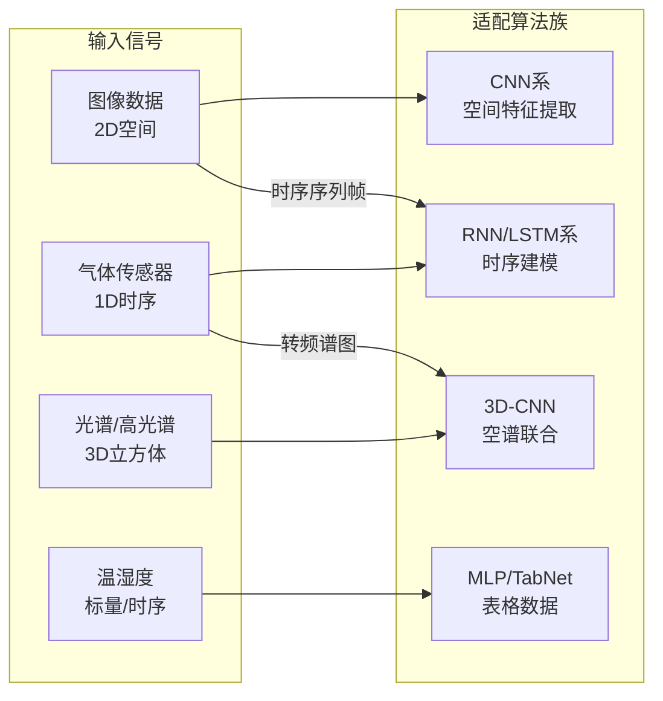

# 机器/深度学习在冰箱食材新鲜度检测中的应用——综述论文框架

## 论文标题

**机器/深度学习在冰箱食材新鲜度检测中的研究进展：方法、挑战与展望**

*Research Progress of Machine/Deep Learning in Food Freshness Detection for Refrigerators: Methods, Challenges and Outlook*

---

## 一、定位与创新点

### 核心定位

以**算法演进**为唯一主线，按"传统机器学习 → CNN → RNN/LSTM → Transformer → 多模态大模型"这条技术路线，系统综述每种算法在食材新鲜度检测中的：**适用场景、典型架构、关键改进、性能对比、剩余局限**。

### 三个创新点

| 创新点 | 说明 |
|--------|------|
| **算法分类+应用适配双维度框架** | 横轴=算法族（传统ML/CNN/RNN/Transformer/大模型），纵轴=检测任务（分类/回归/多任务），交叉分析每格的适配性 |
| **从"实验室→冰箱"的域迁移分析** | 重点分析通用食品检测方法在冰箱特殊约束（低温弱光、遮挡、边缘部署、传感器廉价化）下的退化与改进 |
| **算法+硬件的协同设计视角** | 不孤立讲算法，而是分析算法选择如何受传感器类型、计算资源、功耗预算的约束 |

---

## 二、论文详细大纲

---

### 摘要

- 食材新鲜度智能检测是智能冰箱的核心功能之一
- 机器/深度学习方法已成为该领域的主流技术路线
- 本文检索2015-2026年间XXX篇相关文献，按算法演进脉络系统梳理：
  - 传统机器学习方法（SVM、RF、PCA+LDA等）
  - 卷积神经网络方法（ResNet、YOLO系列、EfficientNet等）
  - 循环/时序神经网络方法（LSTM、GRU、TCN等）
  - Transformer及注意力机制方法（ViT、Swin Transformer等）
  - 大模型方法（LLM/VLM在冰箱场景的初步探索）
- 总结各算法族的适用性、性能表现和待解决问题
- 展望端侧推理、自监督学习、多模态大模型等未来方向

---

### 第一章 引言

#### 1.1 研究背景

- 全球食物浪费（FAO数据：全球1/3食物被浪费，冰箱管理不善是家庭端主要原因之一）
- 智能冰箱市场增长（2025年全球市场规模，AI功能成为差异化核心）
- 新鲜度检测作为智能冰箱"感知-决策-执行"闭环的关键第一步

#### 1.2 问题定义

- 新鲜度检测的机器学习建模：
  - **分类任务**：新鲜/次新鲜/腐败 → 多分类
  - **回归任务**：剩余可食用天数 → 回归
  - **多任务**：同时输出类别+新鲜度等级+剩余天数
- 输入信号类型：图像、气体传感器时序、光谱、温湿度 → 决定了算法选择

#### 1.3 与已有综述的区别（关键！）

| 已有综述 | 视角 | 本文区别 |
|----------|------|----------|
| 电子鼻在食品中的应用（多篇） | 传感器视角：以电子鼻为线索 | 以**算法**为线索，电子鼻只是输入载体之一 |
| 食品质量视觉检测综述 | 应用视角：以食品类型为线索 | 以**算法族**为线索，跨食品类型对比 |
| 深度学习在食品安全中的应用（丁浩晗2025） | 全链条：检测+追溯+预警 | 聚焦**新鲜度检测**单一任务，做深做透 |
| 多模态融合综述（CMC 2024） | 通用方法论 | 聚焦**冰箱+新鲜度**垂直场景的算法适配 |

**→ 本文填补的空白：没有一篇综述从机器/深度学习算法的视角，系统梳理食材新鲜度检测这个垂直问题。**

#### 1.4 文献检索方法

- 数据库：Web of Science / Scopus / IEEE Xplore / ACM DL / CNKI
- 关键词组合：
  ```
  (food freshness OR food spoilage OR food quality)
  AND
  (machine learning OR deep learning OR CNN OR YOLO OR
   RNN OR LSTM OR Transformer OR neural network)
  ```
- 时间：2015.01 - 2026.05
- 检索日期：2026年5月
- 筛选标准：
  - 纳入：明确使用ML/DL方法 + 以食材新鲜度/腐败检测为核心任务
  - 排除：纯硬件/传感器设计无算法贡献、仅做食材分类不涉及新鲜度、非英文/中文文献
- **必须画PRISMA流程图**

---

### 第二章 食材新鲜度检测的问题建模与评价体系

#### 2.1 食材腐败的理化基础（简述，1-2页）

> 这部分不需要写很长，只需给出"算法需要检测什么"的物理解释

- 肉类腐败：蛋白质分解→TVB-N↑、微生物增殖、脂肪酸败
- 果蔬腐败：呼吸作用、乙烯释放、细胞壁降解
- 腐败过程释放的VOCs（氨气、硫化氢、三甲胺、乙醇等）
- **→ "新鲜度"是一个多维度概念：外观变化 + 气味变化 + 化学变化 → 需要多类型数据输入 → 影响算法设计**

#### 2.2 算法任务的数学建模

| 任务类型 | 数学形式 | 典型场景 |
|----------|----------|----------|
| 二分类 | P(y=1\|x) ∈ {fresh, spoiled} | 简单腐败判别 |
| 多分类 | P(y=k\|x), k∈{1,…,K} | 新鲜/次新鲜/轻度腐败/重度腐败 |
| 序数回归 | 保持类别间有序关系 | 新鲜度等级（hold-consume-discard） |
| 回归 | ŷ = f(x), ŷ∈ℝ | 剩余可食用天数预测 |
| 多任务 | (ŷ₁, ŷ₂, ŷ₃) = f(x) | 食材类别+新鲜度+剩余天数 |
| 时序预测 | ŷₜ₊₁ = f(x₁,…,xₜ) | 根据历史数据预测未来新鲜度变化 |

#### 2.3 评价指标体系

| 任务 | 指标 |
|------|------|
| 分类 | Accuracy / Precision / Recall / F1 / mAP（目标检测）/ Cohen's Kappa |
| 回归 | MAE / RMSE / R² / MAPE |
| 部署 | 推理延迟(ms) / 模型大小(MB) / FLOPs / 内存占用 |

#### 2.4 输入信号类型与算法选型的映射



---

### 第三章 传统机器学习方法

#### 3.1 概述

- 2015-2020年间的主流方法
- 依赖手工特征工程
- 至今在特定场景仍有价值（数据量小、可解释性要求高、嵌入式部署）

#### 3.2 基于颜色/纹理特征的视觉方法

- 特征提取：RGB/HSV/L\*a\*b\*颜色统计、GLCM纹理、LBP、形态学特征
- 分类器：SVM（核函数选择：RBF vs Linear）、Random Forest、KNN
- 典型工作分析（3-5篇）
- 局限：手工特征 → 泛化差；不同光照条件下特征漂移

#### 3.3 基于PCA/LDA的气体传感信号处理方法

- 电子鼻数据→PCA降维→LDA判别→分类
- 信号预处理（基线校正、归一化、漂移补偿）对结果的影响
- KNN/SVM/ANN在电子鼻数据上的性能对比
- 局限：交叉敏感解耦能力弱；传感器漂移导致模型频繁重训练

#### 3.4 多模态浅层融合

- 早期融合：视觉特征+气体特征拼接→SVM
- 决策融合：各模态独立分类→多数投票/加权投票
- 局限：特征工程工作量大，模态间非线性交互无法捕捉

#### 3.5 传统方法的统一对比表

| 工作 | 年份 | 输入模态 | 特征 | 分类器 | 食材类型 | ACC | 局限 |
|------|------|----------|------|--------|----------|-----|------|
| ... | ... | ... | ... | ... | ... | ... | ... |

#### 3.6 传统方法的剩余价值讨论

- 数据稀缺场景下的baseline
- 嵌入式MCU端部署的可行方案
- 与深度方法的混合策略（DL做特征提取 + 传统分类器）

---

### 第四章 卷积神经网络（CNN）方法

> **这是文献最多的章节，也是综述的主体**

#### 4.1 CNN在食材新鲜度检测中的三种应用范式

```
范式A：图像分类
  输入：单张食材图片 → 输出：新鲜/腐败
  代表：ResNet / VGG / EfficientNet / MobileNet

范式B：目标检测
  输入：冰箱内部场景图 → 输出：食材位置+类别+新鲜度
  代表：YOLOv5/v8/v10/v11/v12

范式C：语义分割
  输入：食材图片 → 输出：腐败区域逐像素标注
  代表：UNet / DeepLab / SegFormer
```

#### 4.2 基于图像分类CNN的方法

- **经典CNN应用**：ResNet-50/VGG-16/EfficientNet做水果/蔬菜/肉类新鲜度二分类/多分类
- **关键改进方向**：
  - 多尺度特征融合（FPN结构）
  - 注意力机制增强（SENet/CBAM嵌入CNN）
  - 细粒度分类（双线性CNN、度量学习）
- **从通用食品→冰箱场景的适配改进**：
  - 冰箱光照不均→数据增强（模拟暗光/阴影）或光照归一化
  - 冰箱视角受限→多视角融合或多帧聚合
- 代表性工作对比表

#### 4.3 基于YOLO系列目标检测的方法

> 这是近几年文献最密集的方向，需要重点展开

- **YOLO系列在新鲜度检测中的演进**：
  - YOLOv5（2020）：首次在水果新鲜度±腐败检测中验证可行性
  - YOLOv8（2023）：引入Anchor-Free，精度提升显著
  - YOLOv10（2024）：NMS-Free训练，端到端推理
  - YOLOv11（2024）：更强的C3k2模块，适应复杂背景
  - YOLOv12（2025）：引入注意力机制到检测头

- **性能演进表**（核心表格）：

| 模型 | 年份 | 数据集 | mAP@0.5 | FPS | 参数量 | 食材类别 | 来源 |
|------|------|--------|---------|-----|--------|----------|------|
| YOLOv5s | 2020 | 自建水果5类 | 89.2% | 120 | 7.2M | 苹果/香蕉/橙子… | [ref] |
| YOLOv8n | 2023 | 自建果蔬10类 | 92.5% | 160 | 3.2M | 水果+蔬菜 | [ref] |
| YOLOv10n | 2024 | 自建冰箱场景 | 93.1% | 180 | 2.7M | 冰箱常见食材 | [ref] |
| YOLOv11n | 2024 | Fruit-360子集 | 94.8% | 195 | 2.6M | 水果15类 | [ref] |
| YOLOv12n | 2025 | 自建30类食材 | 95.3% | 210 | 2.5M | 水果+蔬菜+肉类 | [ref] |
| ... | ... | ... | ... | ... | ... | ... | ... |

- **冰箱场景下的特殊挑战与改进**：
  - 遮挡问题（食材堆叠）→ 改进NMS策略、引入Occlusion-aware Loss
  - 小目标检测（樱桃、草莓等小水果）→ 改进特征金字塔、增加小目标检测头
  - 类别不平衡（腐败样本少）→ Focal Loss、类平衡采样

#### 4.4 轻量化CNN与边缘部署

- **为什么冰箱需要轻量化**：
  - 冰箱嵌入式芯片算力有限（典型：ARM Cortex-A/M系列）
  - 持续运行需要低功耗
  - 隐私数据需端侧处理（不上云）

- **轻量化方法在新鲜度检测中的应用**：
  | 方法 | 原理 | 典型压缩率 | 精度损失 |
  |------|------|-----------|----------|
  | MobileNet系列 | 深度可分离卷积 | 4-8× | 1-3% |
  | EfficientNet | NAS搜索最优缩放 | 5-10× | 1-2% |
  | ShuffleNet | 通道混洗 | 3-6× | 2-4% |
  | 知识蒸馏 | Teacher→Student | 3-5× | 1-2% |
  | INT8量化 | FP32→INT8 | 4× | <1% |
  | 结构化剪枝 | 移除冗余通道 | 2-4× | 1-3% |
  | 组合策略 | 蒸馏+量化+剪枝 | 10-20× | 2-5% |

#### 4.5 CNN方法的优势与局限总结

| 优势 | 局限 |
|------|------|
| 自动特征学习，免手工设计 | 仅处理空间信息，忽略时序 |
| 预训练模型迁移效果好 | 对遮挡/光照敏感 |
| 工程生态成熟（ONNX/TensorRT） | 全局上下文理解弱于Transformer |
| YOLO系列适合实时检测 | 腐败早期外观变化不明显时失效 |

---

### 第五章 时序神经网络方法（RNN/LSTM/TCN）

#### 5.1 为什么新鲜度检测需要时序建模

- 腐败是**过程**，不是瞬间状态。当前时刻的新鲜度依赖历史轨迹
- 气体传感器响应有**滞后性**（MOS传感器响应时间通常10-60s）
- 传感器采集的本身就是**时间序列**（气体浓度随时间变化曲线）
- 冰箱环境温度有**周期性波动**（开门/关门、化霜周期）

#### 5.2 LSTM/GRU在气味传感新鲜度检测中的应用

- **标准范式**：电子鼻传感器阵列→滑动窗口截取时序段→LSTM→新鲜度分类/回归
- **为什么LSTM优于传统ML**：
  - 自动捕获气体响应的动态特征（上升时间、稳态值、恢复曲线）
  - 对传感器交叉敏感有更强的"解耦"能力
  - 可以处理变长序列（不同食材腐败速度不同）
- 代表性工作对比表
- 关键改进：
  - 双向LSTM（Bi-LSTM）捕获前后文关联
  - 注意力+LSTM：让模型关注对腐败敏感的关键气体通道
  - CNN-LSTM混合：CNN提取局部时域特征→LSTM建模长程依赖

#### 5.3 TCN（时间卷积网络）的替代方案

- TCN vs LSTM 对比：
  | 维度 | LSTM | TCN |
  |------|------|-----|
  | 并行化 | 否（递推） | 是（卷积） |
  | 长程依赖 | 门控机制 | 膨胀卷积 |
  | 训练速度 | 慢 | 快（并行） |
  | 内存占用 | 低 | 高（感受野大时） |
- 在气体信号处理中的应用潜力和局限性

#### 5.4 时序预测：从"检测现在"到"预测未来"

- **轨迹预测范式**：已知第1-5天新鲜度数据→预测第6-7天新鲜度
- 序列到序列模型（Seq2Seq）、时间序列Transformer
- 这种工作在冰箱场景的价值：提前预警"还有N天变质"，引导用户优先食用

#### 5.5 RNN类方法的优势与局限

| 优势 | 局限 |
|------|------|
| 天然适合时序数据 | 训练慢、梯度问题 |
| 捕获动态过程 | 对长序列建模退化 |
| 与CNN互补（空间+时间） | 单独使用时缺少空间感知 |

---

### 第六章 Transformer与自注意力机制方法

#### 6.1 Transformer在计算机视觉中的崛起与食品领域的渗透

- ViT（2020）→ Swin Transformer（2021）→ 食品图像分类中的尝试
- Transformer vs CNN 在食材鲜度检测中的对比：
  - CNN：局部感受野→擅长纹理/边缘→腐败斑点的局部检测
  - Transformer：全局自注意力→擅长全局上下文→整颗菜的整体新鲜度判断
  - Corruption初期：外观变化细微但全局性（整颗菜逐渐萎蔫）→ Transformer可能更有优势

#### 6.2 视觉Transformer（ViT/Swin）在新鲜度分类中的应用

- 代表工作分析（3-5篇）
- 注意力可视化：模型在腐烂斑点、变色区域、萎蔫边缘上的注意力分布
- 与CNN的互补性讨论

#### 6.3 时序Transformer在气体信号中的应用

- 时间序列Transformer替代LSTM处理电子鼻信号
- 位置编码替代RNN的递推结构
- 自注意力自动发现"哪些传感器通道在什么时间点对腐败最敏感"

#### 6.4 跨模态Transformer融合

- 将Transformer用作多模态融合的统一骨干：
  - 图像Patch → Image Token
  - 气体时序段 → Gas Token
  - 温湿度标量 → Env Token
  - → 统一输入Transformer编码器 → 跨模态自注意力
- 这种方法在学术文献中刚出现，分析其潜力和挑战

#### 6.5 Transformer方法的优势与局限

| 优势 | 局限 |
|------|------|
| 全局上下文建模 | 计算量大（O(n²)） |
| 天然多模态扩展 | 小数据集易过拟合 |
| 可解释性（注意力可视化） | 边缘部署不成熟 |

---

### 第七章 大模型（LLM/VLM）在冰箱场景的初步探索

#### 7.1 从"感知智能"到"认知智能"的跨越

```
传统路线：识别→判断新鲜度→结论
大模型路线：看见食材→理解状态→生成建议
  例："这盒草莓已有2个发霉，建议今天食用完剩余完好的部分，
       可做成草莓奶昔，需要食谱吗？"
```

#### 7.2 三星Gemini冰箱（2026年5月）的开创性分析

- 技术方案：视觉编码器 + Gemini模型 → 食材识别 + 状态评估 + 自然语言交互
- 云端推理模式 vs 端侧推理的取舍
- 对行业的技术启示和标杆效应

#### 7.3 VLM（视觉语言模型）在食材新鲜度评估中的潜力

- CLIP/BLIP-2/LLaVA 等VLM的零样本新鲜度判断能力
- Prompt工程示例："这张图片中的草莓新鲜程度如何？请从1-10打分"
- 现有局限：
  - 细粒度差异不够敏感（"还新鲜"vs"快坏了"的微妙差异）
  - 幻觉问题（看不到的食材也给出描述）
  - 推理延迟对实时冰箱场景偏大

#### 7.4 轻量化LLM的边缘部署前景

- TinyLlama/Phi-3/Qwen2.5-0.5B等小模型的潜力
- 专用微调：用食材新鲜度领域数据SFT/RLHF
- 模型量化到4-bit/8-bit后的端侧可行性
- 三星已验证可行性，更多厂商将跟进

---

### 第八章 算法-硬件协同设计

> 这部分是本文的差异化亮点——不讲纯算法，而是分析算法如何受硬件约束

#### 8.1 冰箱嵌入式平台的计算约束

| 平台 | 算力 | 典型模型上限 | 功耗预算 |
|------|------|-------------|----------|
| ARM Cortex-M4/M7 | <1 GOPS | TinyML（<100KB模型） | <100mW |
| 树莓派5 | ~13 TOPS (NPU) | MobileNet/YOLO-nano | 5-15W |
| NVIDIA Jetson Nano | 472 GFLOPS | YOLO-small/ResNet-18 | 5-10W |
| Rockchip RK3588 | 6 TOPS (NPU) | YOLO-nano/EfficientNet-B0 | 3-7W |
| 手机芯片（骁龙8系） | 20+ TOPS | 中等模型 | 需要散热 |

- **关键矛盾**：精度需求 ↑ → 模型变大 ↑ → 推理变慢 — 与冰箱嵌入式平台形成三角冲突

#### 8.2 输入信号对算法选择的约束

| 输入信号 | 采样率 | 数据维度 | 适配算法 | 计算负载 |
|----------|--------|----------|----------|----------|
| RGB图像 | 1-30fps | 224×224×3 | CNN/Transformer | 高 |
| 气体传感器阵列 | 1-100Hz | 5-10通道时序 | 1D-CNN/LSTM | 低 |
| 高光谱 | <1fps | λ×H×W | 3D-CNN | 极高 |
| 温湿度 | 0.1-1Hz | 2-3标量 | MLP | 极低 |

→ **设计空间的权衡**：精度高的方法计算量大，计算量小的方法信息有限

#### 8.3 实用部署策略的总结

- **分级部署策略**：
  - 基础冰箱（低成本）→ 传统ML + 简单CNN，端侧全量推理
  - 中端冰箱 → 轻量化深度模型（MobileNet/YOLO-nano），边缘推理
  - 高端冰箱（配屏幕/GPU）→ 大模型云端推理 + 端侧预处理

- **异步推理策略**：
  - 开门时→高速检测（实时，30fps）
  - 关门后→低速巡检（每小时一次，评估新鲜度变化趋势）
  - 省电优先→传感器触发（仅在气体/T变化时唤醒推理）

---

### 第九章 公开数据集与Benchmark

#### 9.1 食品图像数据集

| 数据集 | 规模 | 类别数 | 有新鲜度标注？ | 冰箱场景？ |
|--------|------|--------|---------------|-----------|
| Food-101 | 101k | 101 | 否 | 否 |
| Fruit-360 | 90k+ | 131 | 部分（fresh/rotten） | 否 |
| VegNet | - | 多种蔬菜 | 否 | 否 |
| UEC Food-256 | 25k | 256 | 否 | 否 |
| Fruits fresh and rotten | ~13k | 6类水果 | fresh/rotten二分类 | 否 |
| 自建冰箱场景数据集 | 各文献自建 | 5-30类 | 有 | 是（但未公开） |

**核心问题：冰箱场景下的标准化新鲜度公开数据集严重缺失**

#### 9.2 气体传感数据集

- UCI Gas Sensor Dataset（通用气体，非食品）
- 肉类腐败公开数据集极少
- 多数工作使用自建数据，不可复现、不可比较

#### 9.3 缺乏标准化Benchmark的后果

- 不同论文声称的"95%准确率"不可直接对比
- 阻碍领域进展

#### 9.4 构建标准Benchmark的建议

- 提出一个理想的冰箱场景新鲜度检测Benchmark应包含的要素
- 作为对未来研究者的呼吁和建议

---

### 第十章 关键挑战与未来方向

#### 10.1 关键挑战

| 挑战 | 描述 | 当前进展 |
|------|------|----------|
| 数据短缺 | 冰箱场景多模态标注数据稀缺 | 各团队自建，无法共享 |
| 域迁移 | 实验室→真实冰箱光照/背景/视角变化大 | 数据增强缓解，未根本解决 |
| 开放集问题 | 冰箱中出现训练集未见的食材/包装 | 几乎无人研究 |
| 长尾分布 | 腐败样本远少于新鲜样本 | Focal Loss改善有限 |
| 时序建模不足 | 多数方法只做单帧判断 | 时序方法开始出现 |
| 传感器漂移 | 影响长期部署的可靠性 | 周期性校准为主，自适应校准待突破 |
| 计算约束 | 高精度模型 vs 嵌入式平台 | 轻量化 + 端云协同 |
| 可解释性 | 用户想知道"为什么判断不新鲜" | 注意力可视化、Grad-CAM初步尝试 |

#### 10.2 未来研究方向

1. **自监督学习降低标注依赖**
   - 利用冰箱日常数据流进行预训练（开门图像天然形成时序）
   - 掩码自编码器（MAE）重构食材图像 → 学习新鲜度无关的通用特征

2. **时序新鲜度预测模型**
   - 不只是"现在新鲜吗"，而是"还能放几天"
   - 需要在时序标注数据上建模（连续多日跟踪同一食材）

3. **轻量化大模型**
   - 从GPT-4V到TinyVLM的蒸馏
   - 冰箱专用小语言模型 → 食材建议、食谱生成

4. **持续学习（Continual Learning）**
   - 冰箱是"终身学习"的天然场景
   - 每天接触新食材、新包装 → 模型需要不断适应
   - 灾难性遗忘问题的缓解策略

5. **联邦学习与隐私保护**
   - 冰箱数据涉及家庭饮食隐私，不能直接上传云端
   - 联邦学习：多冰箱协同训练，数据不出家门

6. **多模态统一表征**
   - ImageBind/CLIP式的统一表征 → 视觉+气体+文本对齐
   - "这张图和这个气体信号都意味着'新鲜'"——隐空间对齐

7. **开放Benchmark建设**
   - 公开数据集 + 统一评估协议 + 基线模型
   - Web平台（参考PapersWithCode）持续追踪

---

### 第十一章 结论

- 本文检索2015-2026年XXX篇文献
- 以算法演进为主线，系统综述了5个算法族在食材新鲜度检测中的应用
- 核心发现：
  1. CNN系（特别是YOLO）是当前最成熟的方法族，但单独使用有天花板
  2. 时序建模（LSTM/TCN/时序Transformer）是处理气体传感数据的标准范式
  3. 多模态融合尚处于"拼接+MLP"阶段，跨模态注意力融合是新方向
  4. 大模型（VLM/LLM）刚进入冰箱场景，三星2026年产品是里程碑
  5. 算法-硬件协同设计是工程落地的前提，不能脱离计算约束谈算法
- 研究展望：自监督+持续学习+联邦学习将推动冰箱从"被动检测"走向"主动管理"

---

### 参考文献

目标60-100篇，覆盖2015-2026

---

## 三、你必须完成的重点工作

### A. 文献检索（2-3周）

按以下检索式在 **Google Scholar + CNKI** 检索，目标收集80-120篇初筛文献：

**英文检索式：**
```
1. ("food freshness" OR "food spoilage" OR "food quality assessment")
   AND ("machine learning" OR "deep learning")
   AND ("classification" OR "detection" OR "prediction")

2. ("YOLO" OR "CNN" OR "ResNet")
   AND ("fruit freshness" OR "vegetable freshness" OR "meat freshness")

3. ("electronic nose" OR "gas sensor array")
   AND ("food freshness" OR "meat spoilage")
   AND ("LSTM" OR "RNN" OR "1D-CNN")

4. ("transformer" OR "vision transformer")
   AND ("food" OR "fruit" OR "vegetable")
   AND ("quality" OR "freshness")

5. ("lightweight" OR "model compression" OR "edge deployment")
   AND ("food freshness" OR "smart refrigerator")
```

**中文检索式：**
```
1. (食材新鲜度 OR 食品腐败) AND (深度学习 OR 机器学习 OR 神经网络)
2. (YOLO OR 卷积神经网络) AND (水果新鲜度 OR 蔬菜新鲜度 OR 肉类新鲜度)
3. (电子鼻 OR 气体传感器) AND (食品新鲜度 OR 冰箱) AND (LSTM OR 模式识别)
4. (模型轻量化 OR 边缘部署 OR 知识蒸馏) AND (食品检测 OR 智能冰箱)
```

### B. 读论文做笔记（2-3周）

每篇论文记录以下7项到Excel：

| 字段 | 示例 |
|------|------|
| 编号 | R001 |
| 作者/年份 | Smith et al., 2025 |
| 算法族 | CNN/YOLO |
| 具体模型 | YOLOv8n |
| 输入数据 | RGB图像，224×224 |
| 任务 | 水果新鲜度三分类 |
| 数据集（规模） | 自建苹果/香蕉/草莓数据集(5k张) |
| 性能 | mAP 92.5% |
| 所用技术/改进 | 添加CBAM注意力模块 |
| 局限/未来工作 | 冰箱真实环境未验证 |
| 注释 | 可引用YOLO系列对比 |

### C. 写对比表（1周）

至少完成以下6张核心表格：
1. CNN分类方法对比表（≥8行）
2. YOLO系列在新鲜度检测中的性能演进表（≥8行）
3. LSTM/TCN在气体传感中的方法对比表（≥6行）
4. Transformer方法对比表（≥5行）
5. 轻量化部署方案对比表
6. 公开数据集汇总表

### D. 画图

必画图片：
1. PRISMA流程图
2. 算法分类框架总览图（本文核心图）
3. 食材腐败→可检测信号→适配算法的映射图
4. CNN/YOLO架构在新鲜度检测任务中的典型配置图
5. 算法演进时间线图（2015→2026，标注关键里程碑）
6. 精度 vs 推理速度散点图（各方法在坐标系中的位置）

---

## 四、时间规划

| 周次 | 任务 |
|------|------|
| W1-2 | 关键词检索 + 初筛去重 + 获得80-120篇候选 |
| W3-4 | 精读 + 做Excel笔记（每天3-4篇，共50-60篇核心文献） |
| W5 | 归纳分类 + 填写对比表 + 画分类框架图 |
| W6-7 | 写第三章（传统ML）和第四章（CNN/YOLO）——最长的两章 |
| W8 | 写第五、六章（RNN/LSTM + Transformer） |
| W9 | 写第七、八、九章（大模型 + 软硬协同 + 数据集） |
| W10 | 写引言、挑战与未来方向、结论 + 修改润色 + 参考文献格式化 |

---

## 五、投稿建议

| 期刊 | 类型 | 推荐理由 |
|------|------|----------|
| **食品科学** | 中文EI | 中国食品领域顶刊，接受高质量综述 |
| **Artificial Intelligence in Agriculture** | 英文OA(SCI) | 人工智能+食品/农业交叉，精准匹配 |
| **Foods (MDPI)** | SCIE | OA期刊，审稿快，适合综述 |
| **Computers and Electronics in Agriculture** | SCI一区 | 计算机+农业顶级，难度大但价值高 |
| **食品工业科技** | 中文核心 | 难度适中，审稿快 |