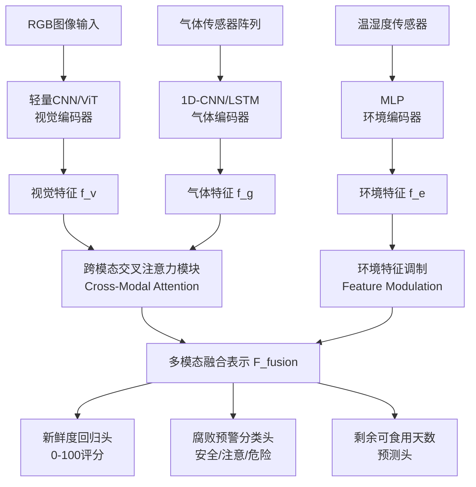
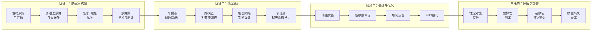

# 基于深度学习与多传感器融合的冰箱食材新鲜度智能检测方法研究

## 论文研究框架

---

## 一、选题背景与研究意义

### 1.1 现实背景
- **食物浪费问题严峻**：全球每年约1/3的食物被浪费，家庭冰箱管理不善是重要原因之一。中国农产品在运输和存储过程中损耗率高达20%以上。
- **冰箱智能化趋势明显**：2025-2026年，智能冰箱进入AI+多传感器融合新阶段。三星2026年5月宣布将Gemini大模型引入Bespoke AI冰箱；海尔首创磁控全空间保鲜技术获国家科技进步奖；海信发布全球首款全域RFID食材管理冰箱。
- **消费者痛点突出**：传统冰箱用户无法实时掌握食材新鲜度状态，"买了忘记吃"、"不知是否还能吃"是高频痛点。

### 1.2 技术背景
- **单一传感器局限**：
  - 纯视觉方案：无法检测气味变化（如氨气、硫化氢等腐败气体），对包装食品/冷冻食品识别能力弱
  - 纯气体传感器方案（电子鼻）：仅能判断腐败程度，无法精确定位和分类食材
  - 纯RFID方案：需食材预贴标签，用户使用门槛高
- **多传感器融合的必要性**：图像传感器（语义信息 + 外观特征）+ 气体传感器阵列（VOCs检测）+ 温湿度传感器（环境上下文）→ 多维信息互补
- **深度学习的技术成熟**：YOLOv12、Transformer等视觉模型精度持续提升；多模态融合框架日益成熟；端侧推理芯片性能提升使边缘计算成为可能

### 1.3 学术价值与应用价值

| 维度 | 内容 |
|------|------|
| **学术创新** | 首次构建面向冰箱场景的"视觉-气体-环境"三模态融合新鲜度检测框架，突破单一模态的信息瓶颈 |
| **应用价值** | 可直接集成至智能冰箱产品，降低食物浪费15%-30%，延长食材有效食用窗口 |
| **产业意义** | 为国标GB 12021.2-2025新能效标准和冰箱智能化升级提供技术支撑 |

---

## 二、国内外研究现状

### 2.1 基于计算机视觉的食材识别与新鲜度检测

**食材识别方向（成熟度高）：**
- CNN集成方法：分别训练果蔬种类识别CNN和颜色识别CNN，通过MLP进行集成分类（2016年学术文献）
- YOLO系列演进：YOLOv5 → YOLOv8 → YOLOv10 → YOLOv11 → YOLOv12，在冰箱场景中支持30+类食材识别
- Transformer方法：利用自注意力机制捕获全局上下文，弥补CNN在遮挡场景下的不足；ViT/Swin Transformer在食材细粒度分类中表现优良

**视觉新鲜度检测（研究热点）：**
- 基于颜色/纹理特征的传统方法：检测食材表面褐变、皱缩等外观变化
- 基于高光谱成像的方法：获取食材光谱特征，实现无损检测（合刃科技2018年专利、北京邮电大学2022年专利）
- 基于深度学习的方法：利用CNN/Transformer直接端到端学习新鲜度-外观映射
- 海尔2024年专利（CN202410647344.5）：通过检测参数反映细菌活跃程度，结合储藏参数修正后确定新鲜度

**现有研究不足：**
- 大多数视觉方法仅依赖外观特征，无法检测食材内部化学变化（腐败早期外观未变但已产生异味）
- 冰箱内部光照不均、遮挡严重、视角受限，通用模型直接迁移效果差
- 缺少公开的冰箱场景新鲜度标注数据集

### 2.2 基于电子鼻/气体传感器的食品新鲜度检测

**技术原理：**
- 模拟生物嗅觉系统，采用MOS气体传感器阵列（对NH₃、H₂S、C₂H₅OH、VOCs等敏感）捕获食品腐败释放的挥发气体
- 传感器阵列 → 信号调理电路 → 模式识别/机器学习 → 新鲜度判定

**代表性工作：**
- 浙江大学王敏等（2019年，《传感技术学报》）：针对冰箱冷藏食品设计智能电子鼻系统，实现原位新鲜度检测
- 知网文献：设计针对肉类、蔬菜、水果三类食品腐败特征气体（氨气、硫化氢、乙醇）的MOS传感器阵列
- 中科微感（2025年）：MEMS气体传感器芯片+AI算法，支持智能家居气味数字化
- 仿生电子鼻PPT综述：利用气敏传感器阵列+模式识别算法识别VOCs成分和浓度

**现有研究不足：**
- 传感器选择性有限，交叉敏感问题突出（多种气体共存时难以区分）
- 传感器漂移和老化问题影响长期稳定性
- 冰箱内部的复杂背景气味（如食材混合气味、塑料挥发物）干扰检测精度
- 传感器阵列小型化和低成本化仍需突破

### 2.3 基于多传感器融合的新鲜度评估

**冰箱领域融合案例：**
- 格力电器2024年专利：自动识别食物类型→确定最佳温度区间→选择目标容置隔间
- 北京邮电大学2022年实用新型专利：气味传感器+摄像头联合检测，通过滑块沿导轨运动实现多维度定位
- 海信全域RFID冰箱（2026年1月发布）：冷藏室+冷冻室+变温室全领域RFID识别与管理
- 西门子iSensoric智感系统：多传感器测量冰箱内外条件，保持温度稳定

**多传感器融合方法分类：**

| 融合层级 | 特点 | 适用场景 |
|----------|------|----------|
| 数据层融合 | 原始数据直接融合，信息保留最完整 | 同质传感器 |
| 特征层融合 | 提取特征后融合，计算效率高 | 异质传感器（本文采用） |
| 决策层融合 | 各模态独立决策后投票/加权融合 | 模态独立性强的场景 |

**现有研究不足：**
- 目前冰箱领域尚无系统性的"视觉+气体+环境"三模态深度融合框架
- 缺少面向冰箱嵌入式场景的轻量化融合模型设计
- 新鲜度量化标准不统一（有的用二分类，有的用天数，有的用感官评分）

### 2.4 研究空白与本研究的切入点

```
┌─────────────────────────────────────────────────────────┐
│                    现有研究空白                           │
├─────────────────────────────────────────────────────────┤
│  1. 缺少视觉-气体-环境三模态融合的新鲜度检测统一框架      │
│  2. 缺少专用于冰箱场景的食材新鲜度多模态数据集            │
│  3. 缺少面向边缘端部署的轻量化多模态模型                  │
│  4. 现有方法新鲜度分级粗粒度（好/坏），缺少精细化评估     │
└─────────────────────────────────────────────────────────┘
                           ↓
┌─────────────────────────────────────────────────────────┐
│                    本研究的切入点                         │
├─────────────────────────────────────────────────────────┤
│  ★ 构建三模态深度融合框架，实现视觉外观+气味特征+        │
│    环境参数的协同感知                                      │
│  ★ 自建冰箱场景多模态新鲜度数据集                          │
│  ★ 设计轻量化跨模态注意力融合网络                         │
│  ★ 提出连续新鲜度评分模型（0-100分）                      │
└─────────────────────────────────────────────────────────┘
```

---

## 三、研究内容与目标

### 3.1 总体研究目标

构建一种面向智能冰箱场景的、基于深度学习与多传感器融合的食材新鲜度智能检测方法，实现对冰箱内食材新鲜度的**多模态、精细化、实时无损**检测。

### 3.2 具体研究内容

#### 研究内容一：冰箱场景多模态食材新鲜度数据集构建

| 要素 | 方案 |
|------|------|
| 食材种类 | 蔬菜类（菠菜、生菜、胡萝卜等）、水果类（草莓、苹果、香蕉等）、肉类（猪肉、牛肉、鸡肉等），共15-20类常见食材 |
| 数据模态 | RGB图像（多角度、多光照）+ 气体传感器阵列信号（NH₃、H₂S、C₂H₅OH、VOCs等5-8路）+ 温湿度环境参数 |
| 采集条件 | 4°C冷藏环境，模拟真实冰箱存储条件，连续采集7-14天 |
| 标注标准 | 结合感官评价（参照GB/T 22210）、TVB-N值、菌落总数，建立0-100分新鲜度指数 |
| 数据规模 | 目标图像≥10,000张，气体信号≥5,000组时间序列样本 |

#### 研究内容二：多模态特征提取与对齐方法

**视觉模态特征提取：**
- 基于改进的轻量化CNN（MobileNetV4/EfficientNet）或轻量ViT提取食材外观特征
- 设计食材状态描述子：颜色变化特征（HSV空间统计）、纹理退化特征（LBP/GLCM）、形态完整性特征

**气体模态特征提取：**
- 传感器阵列信号预处理：基线校正、归一化、漂移补偿
- 时序特征提取：稳态响应值、响应/恢复时间、积分面积、一阶导数特征
- 基于1D-CNN或LSTM的气体时序信号深度特征提取

**多模态对齐：**
- 时间戳同步对齐（视觉采样1fps + 气体采样10Hz → 统一1s窗口）
- 对比学习预训练：拉近同一样本的视觉-气体表征，推远不同样本

#### 研究内容三：跨模态注意力融合的新鲜度评估模型

**核心网络架构：**



**关键技术创新点：**

1. **跨模态交叉注意力（CMCA）**：设计视觉-气体双向交叉注意力机制，让视觉特征"关注"相关气体信号通道，气体特征"关注"相关视觉区域
2. **环境自适应门控融合**：利用温湿度作为门控信号，动态调节视觉/气体模态的融合权重（如高温高湿环境下，气体信号权重升高）
3. **渐进式新鲜度回归**：采用序数回归（Ordinal Regression），保证新鲜度预测的单调性和连续性
4. **多任务联合学习**：新鲜度评分 + 腐败预警 + 剩余天数 → 共享编码器 + 任务特定头

#### 研究内容四：边缘端轻量化部署与实时推理优化

- 模型量化：FP32 → INT8量化，精度损失<2%
- 知识蒸馏：用大模型（Teacher）蒸馏小模型（Student），保持精度同时降低计算量
- 推理优化：ONNX/TensorRT部署，目标推理延迟<100ms（满足冰箱嵌入式主控芯片要求）
- 传感器选型优化：通过消融实验确定最小有效传感器组合，降低成本

---

## 四、技术路线



---

## 五、创新点总结

| 编号 | 创新点 | 创新性说明 |
|------|--------|------------|
| **创新点1** | **三模态深度融合框架** | 首次在冰箱场景中系统整合视觉、气体、环境三模态，设计跨模态交叉注意力机制实现特征级深度融合，突破现有单模态检测的信息瓶颈 |
| **创新点2** | **环境自适应门控融合** | 提出温湿度驱动的动态门控机制，使融合权重随环境条件自适应调整，增强模型在不同季节/地域下的泛化能力 |
| **创新点3** | **连续新鲜度评分模型** | 基于序数回归和感官-理化联合标注，实现0-100的连续新鲜度量化，解决现有方法仅能二分类（新鲜/腐败）的粗粒度问题 |
| **创新点4** | **冰箱场景专用数据集** | 构建首个面向冰箱环境的多模态食材新鲜度数据集，涵盖RGB图像+气体时序+温湿度三模态，可作为领域基准Benchmark |
| **创新点5** | **边缘端轻量化部署** | 面向实际冰箱产品，通过知识蒸馏+INT8量化+最小传感器组实现模型边缘推理，兼顾精度与工程可行性 |

---

## 六、实验设计

### 6.1 对比实验

- **单模态基线**：纯视觉（CNN/ViT/YOLO）、纯气体（传统ML/1D-CNN/LSTM）、纯环境（MLP）
- **多模态融合方法对比**：Early Fusion（数据层）、Late Fusion（决策层）、本文CMCA（特征层）
- **通用多模态模型对比**：ViLT、CLIP、ImageBind等预训练多模态模型迁移效果
- **消融实验**：逐模块消融（去掉交叉注意力、去掉环境门控、去掉气体模态等）

### 6.2 评价指标

| 指标 | 公式/说明 | 适用任务 |
|------|-----------|----------|
| MAE | 平均绝对误差（预测新鲜度 vs 真值） | 新鲜度回归 |
| RMSE | 均方根误差 | 新鲜度回归 |
| R² | 决定系数 | 新鲜度回归 |
| Accuracy | 腐败预警三分类准确率 | 预警分类 |
| F1-Score | 宏平均F1 | 预警分类 |
| 推理延迟 | ms/样本 | 边缘部署评估 |
| 模型大小 | MB | 边缘部署评估 |

### 6.3 鲁棒性测试

- 不同光照条件（明亮/昏暗/LED）
- 不同食材装载密度（空/半满/全满）
- 传感器漂移模拟（长期测试3个月）
- 跨食材类型泛化（训练集未见食材测试）

---

## 七、论文大纲

```
1  引言
  1.1 研究背景与意义
  1.2 国内外研究现状
      1.2.1 基于计算机视觉的食材识别与新鲜度检测
      1.2.2 基于电子鼻/气体传感器的食品新鲜度检测
      1.2.3 多传感器融合在食品质量评估中的应用
      1.2.4 现有研究不足与本文切入点
  1.3 本文主要贡献
  1.4 论文组织结构

2  相关工作
  2.1 深度学习目标检测与图像分类
  2.2 气体传感器阵列与电子鼻技术
  2.3 多模态融合方法
  2.4 边缘计算与模型轻量化

3  多模态食材新鲜度数据集构建
  3.1 实验平台搭建
  3.2 食材选择与准备
  3.3 数据采集方案
  3.4 新鲜度标注体系
  3.5 数据集统计与划分
  3.6 数据预处理与增强

4  基于跨模态注意力融合的新鲜度检测方法
  4.1 整体框架概述
  4.2 视觉模态编码器
  4.3 气体模态编码器
  4.4 环境模态编码器
  4.5 跨模态交叉注意力融合模块
  4.6 环境自适应门控机制
  4.7 多任务联合学习与损失函数
  4.8 边缘端部署优化

5  实验结果与分析
  5.1 实验设置
  5.2 与单模态方法的对比实验
  5.3 与现有多模态方法的对比实验
  5.4 消融实验
  5.5 鲁棒性分析
  5.6 边缘端推理性能评估
  5.7 可视化与分析讨论

6  总结与展望
  6.1 工作总结
  6.2 不足与未来工作

参考文献

附录
  A. 数据集详细统计
  B. 传感器规格参数
  C. 网络结构细节
```

---

## 八、实验平台与工具

| 项目 | 方案 |
|------|------|
| **实验冰箱** | 改造家用冰箱（安装传感器阵列+摄像头模组），4°C冷藏室 |
| **视觉传感器** | USB摄像头/OV5640模组，1920×1080，补充LED光源 |
| **气体传感器** | MOS传感器阵列（7通道）：TGS2602（VOCs）、TGS2603（胺类/硫化物）、TGS2620（乙醇）、MQ-135（NH₃）、MQ-136（H₂S）、MQ-137（NH₃）、MQ-138（VOCs），外加DHT22温湿度传感器 |
| **主控平台** | 训练：NVIDIA RTX 4090/3090；推理：树莓派5 或 Rockchip RK3588 |
| **深度学习框架** | PyTorch 2.x / TensorFlow 2.x |
| **部署工具** | ONNX Runtime / TensorRT / NCNN |
| **标注工具** | LabelStudio / 自研标注平台 |
| **理化检测** | TVB-N测定（半微量定氮法）、菌落总数测定（平板计数法） |

---

## 九、可行性分析与风险应对

| 风险点 | 应对措施 |
|--------|----------|
| 气味传感器交叉敏感 | 采用传感器阵列+深度学习解耦，通过训练学习交叉响应模式 |
| 传感器长期漂移 | 设计基线校准机制 + 定期标准化校正 + 数据增强模拟漂移 |
| 冰箱内部空间受限 | 设计紧凑型传感器模块 + 扁平化摄像头（参考手机模组） |
| 数据集构建周期长 | 分阶段采集，优先完成3-5类核心食材，逐步扩展 |
| 多模态对齐困难 | 基于时间戳的粗对齐 + 对比学习的细对齐 + 同步触发采集硬件 |

---

## 十、预期成果与时间规划

### 预期成果
1. 冰箱场景多模态食材新鲜度数据集（开源）
2. CMCA-Net跨模态注意力融合模型（开源代码+预训练权重）
3. 学术论文1篇（投稿目标：IEEE Sensors Journal / Food Chemistry / 传感技术学报 / 仪器仪表学报）
4. 原型系统演示（可选）

### 时间规划（6个月周期）

| 阶段 | 时间 | 任务 |
|------|------|------|
| 文献调研+方案细化 | 第1-2周 | 完善文献综述，确定详细技术方案 |
| 实验平台搭建 | 第3-4周 | 改造冰箱，传感器选型采购调试 |
| 数据集采集 | 第5-10周 | 分批次采集、标注、验证 |
| 模型开发训练 | 第8-14周 | 编码器→融合→多任务联合训练 |
| 实验评估 | 第14-18周 | 对比/消融/鲁棒性实验 |
| 论文撰写 | 第16-22周 | 初稿→修改→投稿 |
| 补充实验+修改 | 第22-24周 | 审稿意见回复、补充实验 |