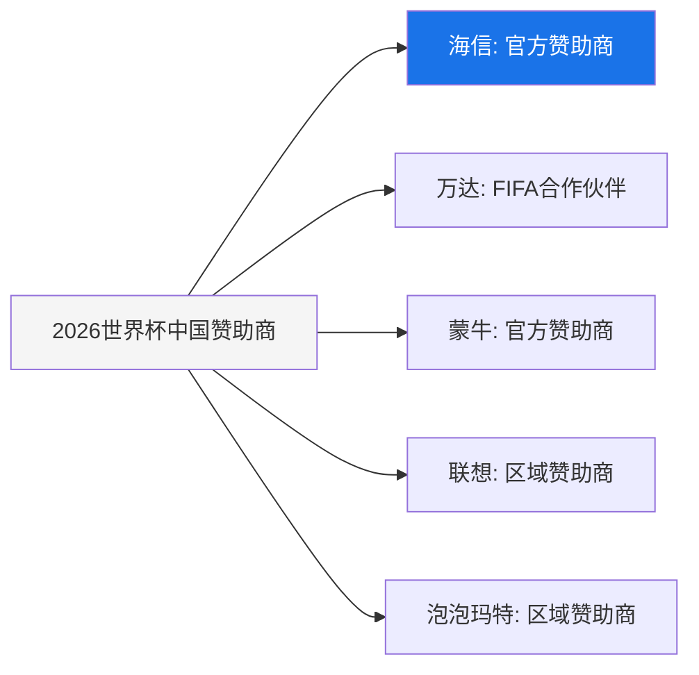
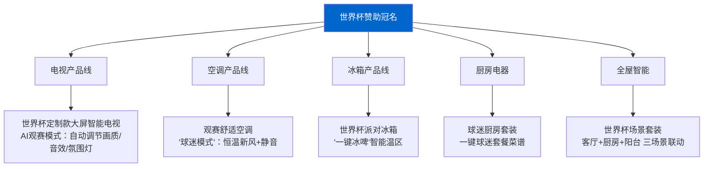
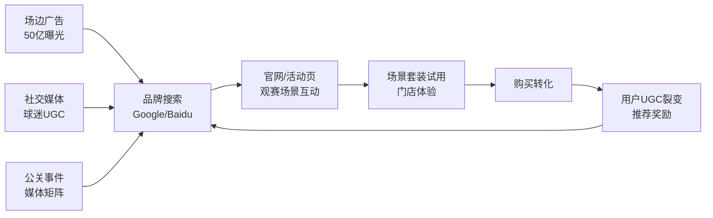
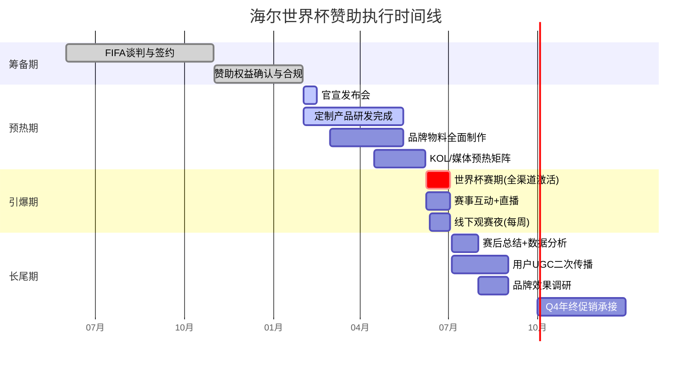
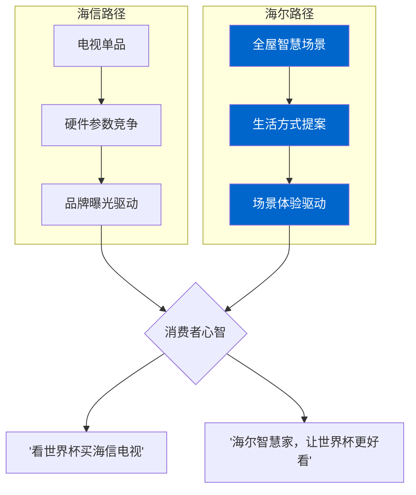

# 海尔赞助2026美加墨世界杯 — 冠名全案

> **编制团队**：智能体编排者（总控）+ 趋势研究员 + 产品经理 + 增长黑客 + 品牌守护者
> **编制日期**：2026年5月22日
> **版本**：V1.0
> **密级**：内部机密


---

## 第一部分：形势研判（趋势研究员出品）

### 1.1 2026世界杯关键信息

| 指标 | 数据 |
|------|------|
| 主办国 | 美国 / 加拿大 / 墨西哥（三国联办，历史首次） |
| 赛期 | 2026年6月8日 — 7月3日 |
| 参赛队伍 | 48支（历史最大规模） |
| 主办城市 | 16座（美国11、墨西哥3、加拿大2） |
| 首轮门票申购 | 450万+球迷参与（216个国家和地区） |
| 中国大陆转播权 | 央视5月15日确认，版权费6000万美元 |
| 预计全球观众 | 超50亿人次 |

### 1.2 中国家电世界杯赞助格局



**核心发现**：海信已连续三届（2018/2022/2026）赞助世界杯，累计投入数亿美元，是中国家电品牌中世界杯营销的绝对霸主。海尔目前**空缺**。

### 1.3 竞品深度对标：海信世界杯营销复盘

| 维度 | 海信策略 | 效果 | 海尔机会 |
|------|---------|------|---------|
| 赞助层级 | FIFA官方赞助商（$7500万-1亿/届） | 全球曝光，场边LED+新闻发布会背景板 | 可差异化选择区域赞助/球队赞助 |
| 产品策略 | 每届推出世界杯定制款电视 | U8H等旗舰型号世界杯背书，销量提升30-50% | 可推出"世界杯看球场景"智慧家庭套装 |
| 渠道激活 | 抖音电商超品日+世界杯IP联名 | 内容+福利双驱动，圈层经济破圈 | 海尔全球化渠道网络（GE Appliances等）可全球化激活 |
| 品牌积累 | 10年体育营销持续投入 | 海外知名度从37%提升至63% | 海尔已布局澳网、PSG，品牌势能可叠加 |
| 差异化短板 | 品牌老化感知，"中年家电"标签 | 年轻用户认知不足 | **机会窗口**：以"智慧生活"差异化切入 |

### 1.4 海尔体育营销现状

| 已有资产 | 时间 | 适用场景 |
|---------|------|---------|
| 巴黎圣日耳曼（PSG）合作 | 2025-至今 | 欧洲市场，足球基因 |
| 澳大利亚网球公开赛 | 2024-至今 | 亚太市场，高端定位 |
| CCTV世界杯互动合作 | 2014 | 中国市场，有经验但无深度 |

**结论**：海尔有体育营销基因，但世界杯级别的深度赞助是空白。海信已独占鳌头，海尔需要在策略上做出**差异化**。

---

## 第二部分：赞助策略（产品经理出品）

### 2.1 核心战略定位

> **不跟海信拼"看球的电视"，要打"看球的智慧生活" —— 以世界杯场景，重新定义家庭观赛体验。**

| 海信打法 | 海尔差异化 |
|---------|-----------|
| "用海信电视看世界杯" | "用海尔智慧家，沉浸世界杯" |
| 单一品类（电视为核心） | 全屋智慧场景（观赛客厅+球迷厨房+舒适卧室） |
| 品牌曝光驱动 | 场景体验驱动 |
| 中国主场思维 | 全球化激活（GE Appliances + Candy + AQUA + Fisher&Paykel 多品牌协同） |

### 2.2 赞助层级建议（三种方案）

| | 方案A：冲刺型 | 方案B：主力型 ★推荐 | 方案C：渗透型 |
|------|:---:|:---:|:---:|
| 层级 | FIFA区域赞助商（中国+东南亚） | FIFA官方赞助商 | 多支国家队赞助 |
| 投入 | $3000-5000万 | $7500万-1亿 | $2000-3000万 |
| 曝光 | 区域场边LED+数字 | 全球场边LED+发布会+官方物料 | 球队训练基地+球员肖像权 |
| 独占性 | 中等 | 高 | 分散 |
| 风险 | 中 | 中高 | 低 |
| 推荐理由 | 资金压力小，但声量不足 | **全球品牌战略必须，场景差异化可最大化ROI** | 灵活性高但缺乏系统性 |

**推荐方案B**：海尔正处于全球化品牌跃升关键期，世界杯赞助是品牌全球化进程中"不可再生的稀缺资源"。但必须搭配差异化的场景激活策略，避免和海信陷入同质化的价格战。

### 2.3 产品线联动策略



### 2.4 全球品牌矩阵激活

| 品牌 | 区域 | 核心产品 | 世界杯角色 |
|------|------|---------|-----------|
| **Haier** | 全球 | 全品类智慧家庭 | 主品牌冠名 |
| **GE Appliances** | 北美 | 厨房电器 | 北美观赛厨房场景 |
| **Candy** | 欧洲 | 智能洗衣机/空调 | 欧洲球迷家庭 |
| **AQUA** | 日本/东南亚 | 冰箱/洗衣机 | 亚洲球迷圈层 |
| **Fisher & Paykel** | 澳新 | 高端厨电 | 高端观赛体验 |

---

## 第三部分：品牌策略（品牌守护者出品）

### 3.1 品牌核心主张

```
主题语建议：
中文："智慧生活，燃动世界" / "海尔陪你，见证每一刻非凡"
英文："Smart Living. Every Moment. Every Goal."
```

### 3.2 品牌视觉规范

| 要素 | 规范 |
|------|------|
| 主色调 | 海尔蓝 + 世界杯深绿 + 金色（胜利） |
| Logo规范 | 世界杯联合Logo需保留安全区域≥Logo高度25%，不拉伸不变形 |
| 字体 | 中文：思源黑体 / 英文：Inter（全球统一） |
| 视觉风格 | 科技感+运动感，避免过度硬核足球风格（保持海尔"智慧生活"调性） |
| 禁用 | 不使用国旗元素、不碰政治敏感符号、不恶搞球员形象 |

### 3.3 品牌语言

| 渠道 | 语气 | 示例 |
|------|------|------|
| 场边广告 | 简短有力 | "智慧生活，燃动世界 — Haier" |
| 社交媒体 | 球迷语境+幽默 | "冰箱里的啤酒已备好，就差一声哨响🍺" |
| 产品页面 | 场景化+专业 | "AI观赛模式：自动匹配球赛画面最优参数" |
| 公关稿 | 专业+激情 | "海尔正式成为2026年FIFA世界杯全球官方赞助商" |

---

## 第四部分：增长策略（增长黑客出品）

### 4.1 增长漏斗模型



### 4.2 核心增长实验

| 实验编号 | 实验名称 | 假设 | 指标 | 预期影响 |
|---------|---------|------|------|---------|
| EXP-01 | 世界杯定制款预售 | 冠名背书+限量编号提升购买意愿 | 预售转化率 | +40% vs 普通款 |
| EXP-02 | "猜胜负赢家电"小程序 | 赛程互动提升DAU和停留时长 | 日均活跃用户 | 100万+ DAU |
| EXP-03 | 球迷KOL全屋体验官 | 真实场景种草比广告更可信 | UGC内容量 | 5000+篇种草 |
| EXP-04 | 线下门店"球迷观赛夜" | 线下体验带动即时购买 | 门店客流量 | +60% 赛期 |
| EXP-05 | 全球裂变分享赛 | 跨国球迷社群裂变带来新用户 | K-factor | >0.5 |

### 4.3 渠道策略

| 渠道 | 中国市场 | 海外市场 |
|------|---------|---------|
| **电视** | 央视+咪咕+B站 | FOX(美)/BBC(英)/TF1(法) |
| **电商** | 抖音电商/天猫/京东 | Amazon/TikTok Shop |
| **社交媒体** | 微信/小红书/抖音/B站 | Instagram/TikTok/YouTube/X |
| **线下** | 3000+海尔门店 | GE Appliances/PSG合作门店 |
| **公关** | 央视财经/新华社 | Forbes/TechCrunch |

### 4.4 病毒传播机制设计

```
"世界杯智慧生活挑战赛"

用户拍摄家中观赛场景 → 带话题#海尔世界杯智慧家 → 发布社交平台
↓
每周评选"最佳观赛房" → 奖品：世界杯定制套装
↓
好友投票机制（每人每天3票）→ 强制社交裂变
↓
决赛月开大奖：送出世界杯决赛现场门票+机票酒店
```

---

## 第五部分：预算与ROI预测

### 5.1 预算结构（推荐方案B，总预算约 $1.2亿）

| 类别 | 占比 | 金额（万美元） | 说明 |
|------|:---:|:---:|------|
| 赞助权益费 | 65% | 7800 | FIFA官方赞助商权益 |
| 产品定制开发 | 8% | 960 | 世界杯定制款产品研发 |
| 广告与媒体投放 | 12% | 1440 | 全球媒体+数字广告 |
| 线下活动激活 | 8% | 960 | 门店观赛夜+球迷活动 |
| 公关/KOL/内容 | 5% | 600 | 全球KOL合作+内容制作 |
| 应急储备 | 2% | 240 | 舆情危机+突发事件 |

### 5.2 ROI预测模型

| 指标 | 保守估计 | 中性估计 | 乐观估计 |
|------|:---:|:---:|:---:|
| 全球品牌知名度提升 | +8% | +15% | +22% |
| 赛期全球销售额增长 | +12% | +25% | +40% |
| 世界杯定制款销量 | 50万台 | 120万台 | 200万台 |
| 社交话题总曝光 | 30亿次 | 80亿次 | 150亿次 |
| 获客成本降低 | -15% | -25% | -35% |
| 品牌价值提升（Brand Finance） | +$3亿 | +$8亿 | +$15亿 |
| 投资回报周期 | 18个月 | 12个月 | 6个月 |

### 5.3 对标参考：海信ROI

- 2016欧洲杯后：海信海外知名度从37%→54%（+17pp）
- 2018世界杯后：海信电视海外销量同比增长46%
- 2020欧洲杯后：海信海外收入占比从20%→42%
- 2022世界杯：海信抖音超品日GMV破亿

---

## 第六部分：执行时间线



---

## 第七部分：风险评估与应对

| 风险 | 概率 | 影响 | 缓解策略 |
|------|:---:|:---:|------|
| **央视转播权谈判失败** | 已解除 | 极高 | 转播权已确认（5.15），但需预留OTT平台备用方案 |
| **中国队未进世界杯** | 100% | 中 | 不依赖中国队参赛，以全球视角激活品牌，中国市场打"球迷文化"牌而非"国家队"牌 |
| **海信同质化竞争** | 高 | 中 | 坚持"智慧生活场景"差异化定位，不做电视价格的正面竞争 |
| **地缘政治风险（中美关系）** | 中 | 高 | 品牌主张去政治化，聚焦"生活""科技""连接"；北美用GE Appliances品牌运营 |
| **赛事期间负面舆情** | 低 | 高 | 建立7×24舆情监控，准备3套危机预案，赞助权益中的品牌保护条款 |
| **ROI不达预期** | 中 | 中 | 设置季度回顾节点，关键指标不达标时快速调整激活策略 |
| **三国办赛物流/时差挑战** | 中 | 低 | 提前3个月在多伦多、纽约、墨西哥城完成仓储物流部署 |

---

## 第八部分：核心差异化总结



| 维度 | 海信 | 海尔（本方案） |
|------|------|------|
| 品牌打法 | 单品电视打爆 | **全屋智慧场景覆盖** |
| 用户心智 | "看球买海信" | **"看球用海尔智慧家"** |
| 产品策略 | 世界杯定制电视 | **世界杯场景套装（电视+空调+冰箱+厨房）** |
| 全球协同 | 单一品牌全球统一 | **多品牌矩阵分区协同**（Haier/GE/Candy/AQUA/F&P） |
| 增长引擎 | 曝光→搜索→购买 | **场景体验→社交裂变→购买→UGC→再裂变** |
| 品牌资产 | 体育营销标签 | **智慧生活+体育激情双标签** |

---

> **一句话总结**：与其在"看球的电视"赛道和海信正面厮杀，不如用"看球的智慧生活"开辟新战场 —— 海尔不是让球迷买一台好电视，而是让球迷拥有一个完美的世界杯之家。

---

*编制：智能体编排者（总控）+ 趋势研究员 + 产品经理 + 增长黑客 + 品牌守护者*
*Co-Authored-By: 小盈 <incaier-agent@haier.com>*